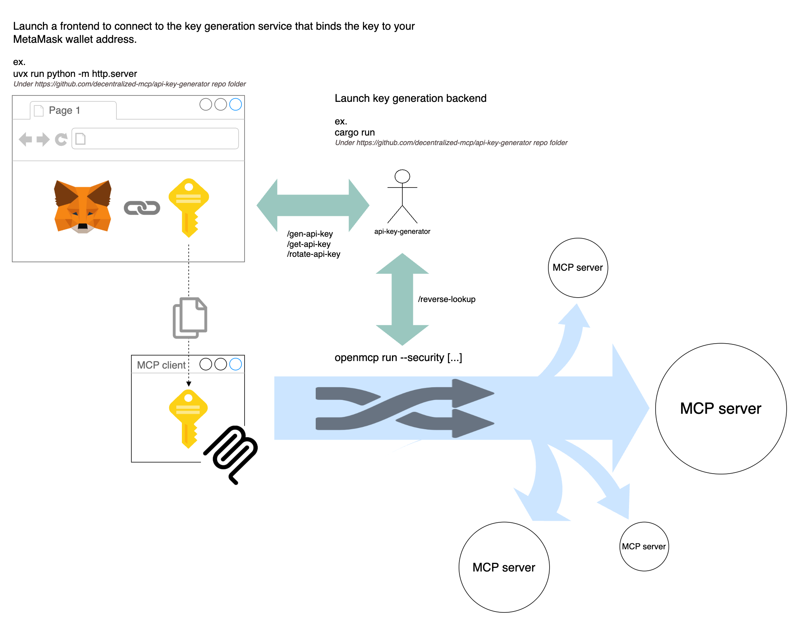

# Cardea

## Features
- Provides a CLI with parameters and options similar to docker
- Connects to a remote server via SSE and exposes it as a stdio server
- Connects to a local server via stdio and exposes it as an SSE server
- Implements an SSE server that acts as a proxy, forwarding events from a remote SSE server

## Usage

### Quick install

```bash
curl -sSfL 'https://raw.githubusercontent.com/cardea-mcp/cardea-cli/refs/heads/master/install.sh' | sudo bash
```

Or, [download the pre-built binary](https://github.com/cardea-mcp/cardea-cli/releases/latest) for your platform. Unzip and drop the `cardea` binary anywhere in your path.

### Building from source

```bash
cargo build --release
```

### Running

The proxy can operate in three modes:

#### 1. SSE Client Mode

Connect to a remote MCP server over SSE and expose it as a stdio server.

This allows a local client such as Claude or Cursor connect to a remote server running on SSE.

```bash
cardea run -p remote_sse_server_host:remote_sse_server_port/sse
```

#### 2. Stdio Client Mode

Connect to a local command using stdio and expose it as an SSE server.

This allows remote SSE connections to a local stdio server.

```bash
cardea run -p exposed_ip:exposed_port your-command
cardea run -p exposed_ip:exposed_port -e KEY=VALUE your-command

cardea run -p 8000 npx -y @modelcontextprotocol/server-everything
```

#### 3. Proxy Mode

Connect to a remote MCP server over SSE and expose it as an SSE server.

This allows remote SSE connections proxy to other remote server.

```bash
cardea run -p exposed_ip:exposed_port:remote_sse_server_host:remote_sse_server_port/sse
```

## Self testing

```bash
// Launch in Stdio Client Mode
cardea run -p 8000 npx -y @modelcontextprotocol/server-everything

// Launch in Proxy Mode, connecting to the SSE server launched above
cardea run -p 8001:http://127.0.0.1:8000/sse

// Run the inspector to verify SSE servers on ports 8000 and 8001
npx @modelcontextprotocol/inspector
```

## Security

Use cardea run `--security` in the same way as cardea run, with all other parameters unchanged.

The process for obtaining the authentication token is described in the diagram below.



### Setup the API Key Server

```console
# Alpha version, please build from source for the latest version
git clone https://github.com/cardea-mcp/api-key-generator
cd api-key-generator
# Build the API Key Server
cargo build --release

# Run the API Key Server
./target/release/api-key-server
# Run the HTTP Server for generating API keys
python3 -m http.server 8080
```

### Obtain the API Key

1. Open the HTTP Server in your browser: `http://localhost:8080`
2. Click on the "Generate API Key" button.
3. Copy the generated API key `sk_...` from the page.

### Start the Cardea CLI with Security

```console
# cardea run --security -p exposed_ip:exposed_port your-command
# Take memory MCP as an example
cardea run --security -p 8000 npx -y @modelcontextprotocol/server-memory
```

### Connect to the MCP Server with the API Key

1. Start the MCP client
    ```console
    # Use inspector as an example
    npx @modelcontextprotocol/inspector
    ```
2. Set the URL: `http://localhost:8000/sse`
3. Click on the "Authentication" button.
4. Paste the API key `sk_...` into the `Bearer Token` field.
5. Click on the "Connect" button.
