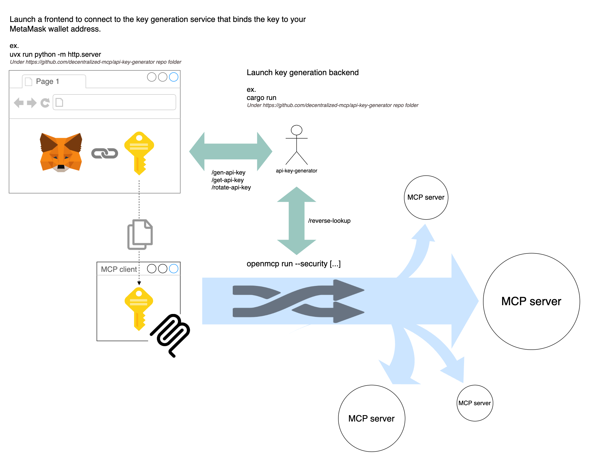

# Open MCP

## Features
- Provides a CLI with parameters and options similar to docker
- Connects to a remote server via SSE and exposes it as a stdio server
- Connects to a local server via stdio and exposes it as an SSE server
- Implements an SSE server that acts as a proxy, forwarding events from a remote SSE server

## Usage

### Quick install

```bash
curl -sSfL 'https://raw.githubusercontent.com/decentralized-mcp/proxy/refs/heads/master/install.sh' | sudo bash
```

Or, [download the pre-built binary](https://github.com/decentralized-mcp/proxy/releases/latest) for your platform. Unzip and drop the `openmcp` binary anywhere in your path.

### Building from source

```bash
cargo build --release
```

### Running

The proxy can operate in three modes:

#### 1. SSE Client Mode

Connect to a remote MCP server over SSE and expose it as a stdio server.

This allows a local client such as Claude or Cursor connect to a remote server running on SSE.

```bash
openmcp run -p remote_sse_server_host:remote_sse_server_port/sse
```

#### 2. Stdio Client Mode

Connect to a local command using stdio and expose it as an SSE server.

This allows remote SSE connections to a local stdio server.

```bash
openmcp run -p exposed_ip:exposed_port your-command
openmcp run -p exposed_ip:exposed_port -e KEY=VALUE your-command

openmcp run -p 8000 npx -y @modelcontextprotocol/server-everything
```

#### 3. Proxy Mode

Connect to a remote MCP server over SSE and expose it as an SSE server.

This allows remote SSE connections proxy to other remote server.

```bash
openmcp run -p exposed_ip:exposed_port:remote_sse_server_host:remote_sse_server_port/sse
```

## Self testing

```bash
// Launch in Stdio Client Mode
openmcp run -p 8000 npx -y @modelcontextprotocol/server-everything

// Launch in Proxy Mode, connecting to the SSE server launched above
openmcp run -p 8001:http://127.0.0.1:8000/sse

// Run the inspector to verify SSE servers on ports 8000 and 8001
npx @modelcontextprotocol/inspector
```

## Security

Use openmcp run `--security` in the same way as openmcp run, with all other parameters unchanged.

The process for obtaining the authentication token is described in the diagram below.



## Extend TSP protocol

[(more dtail)](TSP_EXTEND.md)

- Message mode (not ready)
- Verify mode
The client VID is used solely for generating a bearer token, which is then verified by the openmcp middleware.


